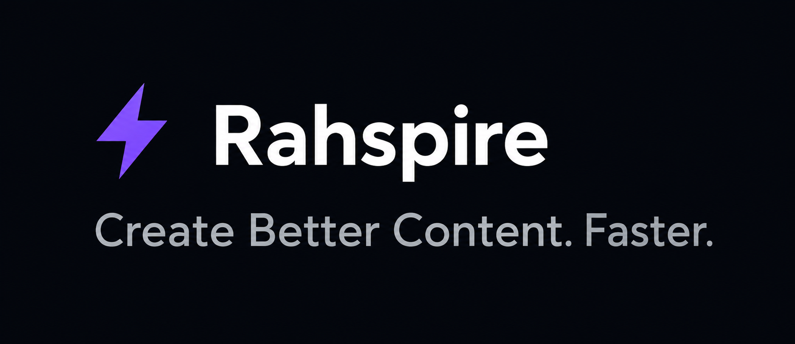
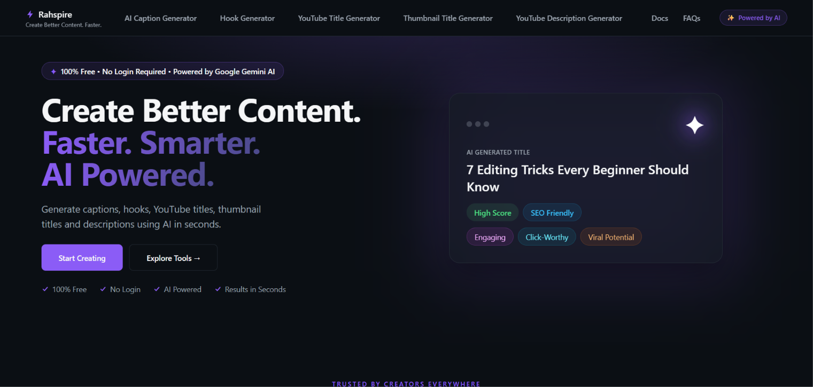
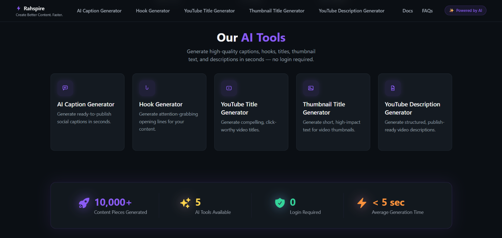
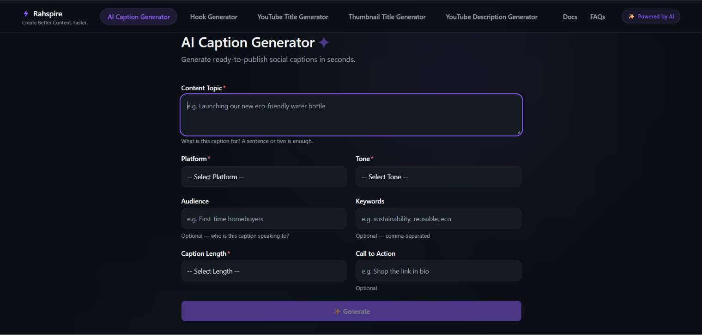
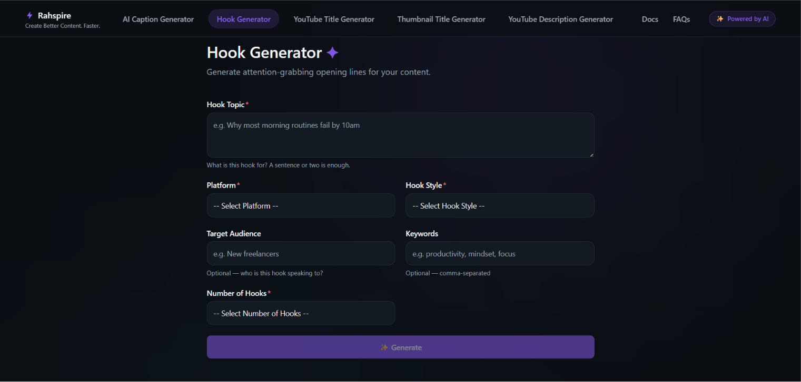
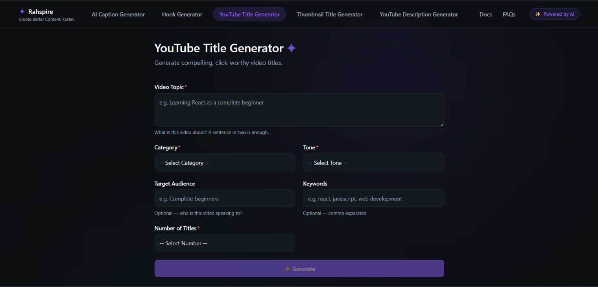
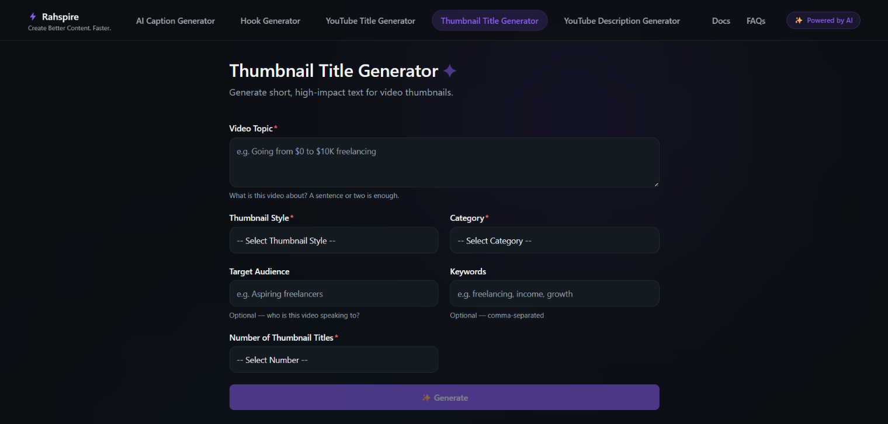
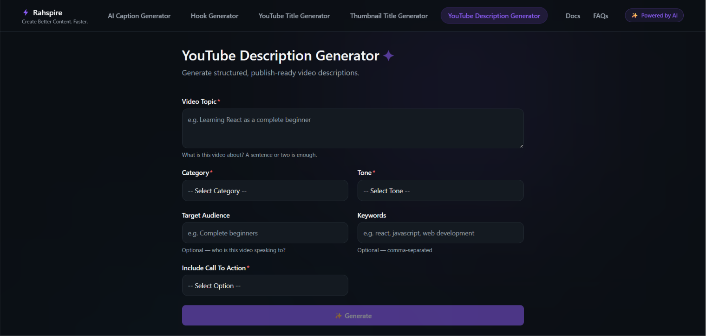
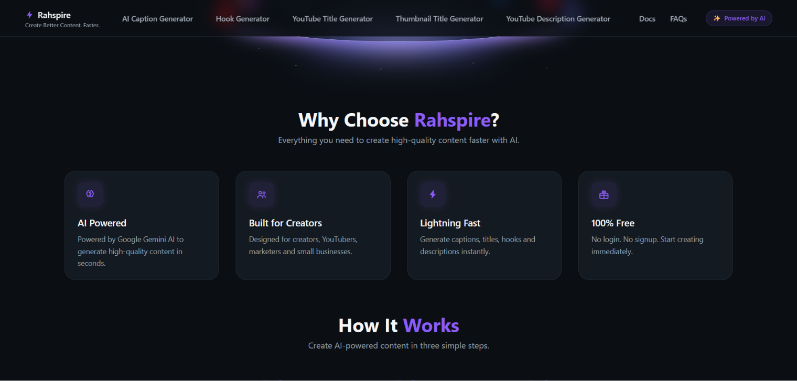
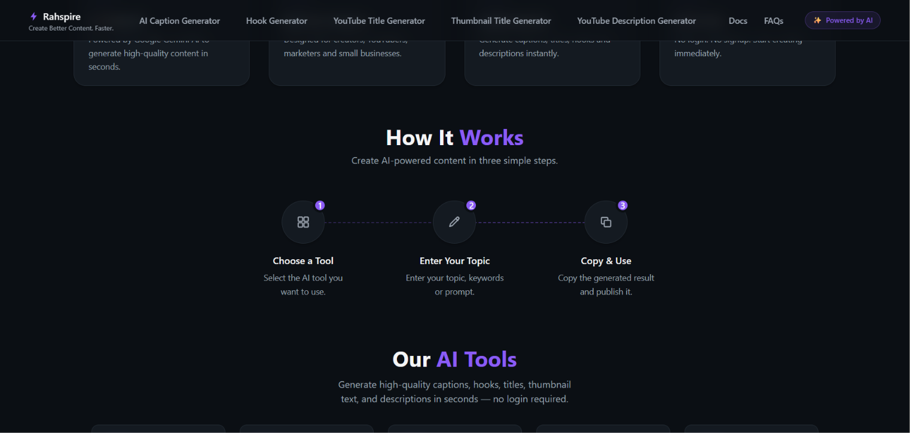

# Rahspire

### AI-Powered Content Creation Platform

Transform ideas into compelling content through a fast, modern, and intuitive AI experience.

🌐 **Live Website:** https://rahspire-web.vercel.app/

---

## ✨ About Rahspire

Rahspire is a modern AI-powered content creation platform built to help creators transform ideas into high-quality content within seconds. By combining specialized AI tools with a clean, distraction-free interface, Rahspire simplifies the creative workflow while maintaining speed, consistency, and quality.

## 🎯 Why Rahspire?

Creating engaging content often involves switching between multiple tools, rewriting prompts, and spending valuable time refining ideas.

Rahspire solves this by bringing powerful AI content generation into one clean, distraction-free platform.

---

## 🚀 What Problem Does Rahspire Solve?

Many AI content generation platforms are powerful, but they often come with unnecessary complexity—multiple subscriptions, cluttered interfaces, login requirements, or workflows that interrupt the creative process.

Rahspire was built with a different philosophy:

- ⚡ No unnecessary setup or complicated workflows
- 🎯 Purpose-built AI tools focused on real creator needs
- 🎨 Clean, distraction-free interface designed for speed
- 📱 Responsive experience across desktop and mobile
- 🆓 Free to use without creating an account
- 🤖 Powered by Google Gemini AI for high-quality content generation

Instead of trying to be an all-in-one AI platform, Rahspire focuses on delivering a fast, intuitive, and enjoyable experience for creators who want quality content with minimal effort.

---

## 🎯 Who Is Rahspire For?

Rahspire is designed for anyone who creates content online, including:

- 🎥 YouTubers
- 📱 Social Media Creators
- 📈 Digital Marketers
- 💼 Entrepreneurs
- 🏢 Small Businesses
- ✍️ Freelancers
- 🎓 Students

---

## 🌟 Rahspire Highlights

- 🤖 AI-powered content generation using Google Gemini AI
- ⚡ Generates high-quality content within seconds
- 🎯 Five specialized AI writing tools
- 📱 Fully responsive mobile-first design
- 🎨 Modern premium UI/UX
- 🔒 No login required
- 🚀 Fast deployment with Vercel

---

## 🚀 Features

### ✍️ AI Content Generation
Generate high-quality content instantly using Google Gemini AI with optimized prompts for accurate and engaging results.

### 🎬 YouTube Title Generator
Create compelling, SEO-friendly titles designed to improve visibility and attract more viewers.

### 📝 YouTube Description Generator
Generate structured, informative, and engaging descriptions that save time while maintaining quality.

### 📸 Caption Generator
Create creative captions for social media posts, helping increase engagement across platforms.

### 🎯 Thumbnail Title Generator
Generate short, attention-grabbing thumbnail titles that complement video content.

### 💡 Hook Generator
Craft powerful opening hooks designed to capture attention within the first few seconds.

### ⚡ Fast & Responsive
Built for speed with a lightweight architecture and responsive design across desktop and mobile devices.

### 🎨 Modern User Experience
A clean, distraction-free interface focused on simplicity, accessibility, and ease of use.

### 🔒 Privacy Focused
No user accounts or unnecessary data collection—just open the website and start creating.

---

## 🖥️ Live Demo

**Website**

https://rahspire-web.vercel.app/

---

## 🛠️ Tech Stack

| Category   | Technologies                                     |
|------------|--------------------------------------------------|
| Frontend   | ⚛️React ·📘TypeScript ·⚡Vite · 🎨Tailwind CSS |
| Backend    | 🟢Node.js · 🚀Express.js                        |
| AI         | ✦ Google Gemini AI                              |
| Deployment | Vercel                                           |

---

## 📸 Product Preview

### HomePage

---

### AI Tools

### 🎬 YouTube Title Generator

---

### 📝 YouTube Description Generator

---

### 💡 Hook Generator

---

### 📸 Caption Generator

---

### 🎯 Thumbnail Title Generator

---
### Why Choose Rahspire

---

### How It Works

---

## 📖 Development Journey

Rahspire started with a simple vision: to simplify AI-assisted content creation through a single, focused platform.

What began as a small idea gradually evolved through multiple iterations of interface design, prompt engineering, feature enhancements, performance optimization, and user experience improvements. Every version brought new refinements driven by one objective—creating a fast, elegant, and genuinely useful experience for content creators.

Rather than becoming another generic AI wrapper, Rahspire has been developed with a strong emphasis on purposeful design, practical functionality, and a seamless user experience. The project continues to evolve with each iteration, guided by continuous learning, experimentation, and real-world feedback.

---

## 🧩 Challenges & Learning

Building Rahspire involved more than developing AI tools. Some key challenges included:

- Designing a scalable architecture for multiple AI generators.
- Creating reusable UI components to keep the codebase maintainable.
- Optimizing prompt engineering for consistent AI responses.
- Building a responsive experience across desktop and mobile.
- Balancing simplicity, performance, and user experience.

---

## 💡 Why I Built Rahspire

Content creation often involves repetitive work, multiple tools, and constant context switching. I built Rahspire to make that process simpler.

The goal was to create a clean, AI-powered platform where creators could generate high-quality content in seconds without unnecessary complexity. Every design choice—from the interface to the user experience—was focused on speed, simplicity, and accessibility.

Rahspire is an ongoing project, and I plan to continue expanding it with new AI tools, improved workflows, and features that genuinely help creators save time.

---

## 🎨 Design Philosophy

Rahspire was built around one simple idea:

> Beautiful software should also be fast, intuitive, and effortless to use.

Every interface, interaction, and animation has been designed to keep creators focused on creating rather than configuring.

---

## 👨‍💻 About the Creator

Hi, I'm **Rahul Khatavkar** — a Software Developer passionate about building modern, user-focused web applications that solve real-world problems through clean design, thoughtful engineering, and artificial intelligence.

Rahspire began as an idea to simplify content creation. Instead of switching between multiple AI tools, I wanted to create a single platform where creators could generate high-quality captions, hooks, YouTube titles, thumbnail titles, and descriptions through a fast, elegant, and intuitive experience.

Beyond web development, I enjoy exploring cloud technologies, DevOps practices, and AI-powered applications. I believe great software is more than just working code—it should be fast, reliable, visually polished, and genuinely enjoyable to use.

Rahspire represents my approach to software development: building products that are practical, scalable, and designed with users at the center of every decision.

If you have ideas, feedback, or opportunities to collaborate, I'd be happy to connect.

---

## 🌱 Future Roadmap

Rahspire is being developed as a long-term platform for creators.
Future releases will focus on:
- User Accounts
- Prompt History
- More AI Tools
- Custom Templates
- Team Workspace
- Export Options
- API Access
- Mobile Application

---

## 💬 Feedback

Feedback, ideas, and feature suggestions are always welcome.

If you discover a bug or have an idea that could improve Rahspire, feel free to open an issue or start a discussion.

---

## ⭐ Support

If you like Rahspire, consider giving this repository a ⭐.

Your support helps the project grow.

---

# © Copyright Notice

**Copyright © 2026 Rahul Khatavkar. All Rights Reserved.**

This repository is published solely for portfolio and showcase purposes.

The **Rahspire** name, branding, logo, user interface (UI), user experience (UX), source code, screenshots, documentation, and all original content contained in this repository are the intellectual property of Rahul Khatavkar and are protected by applicable copyright laws.

No part of this repository may be copied, reproduced, modified, redistributed, republished, reverse engineered, or used to create derivative works without the prior written permission of the copyright holder.

Unauthorized commercial or non-commercial use of any material contained in this repository is strictly prohibited.

For licensing or permission requests, please contact the copyright holder.
---
